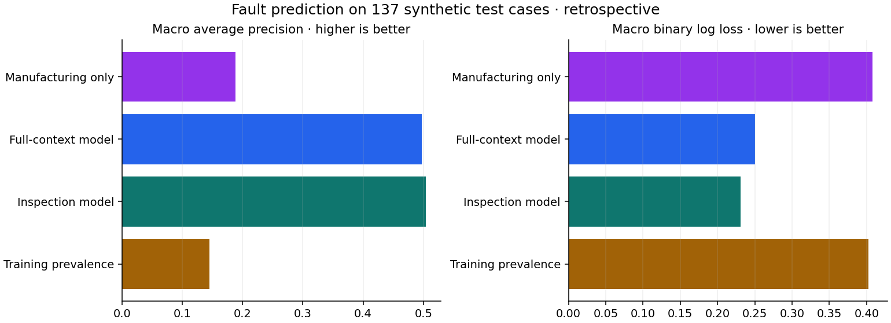
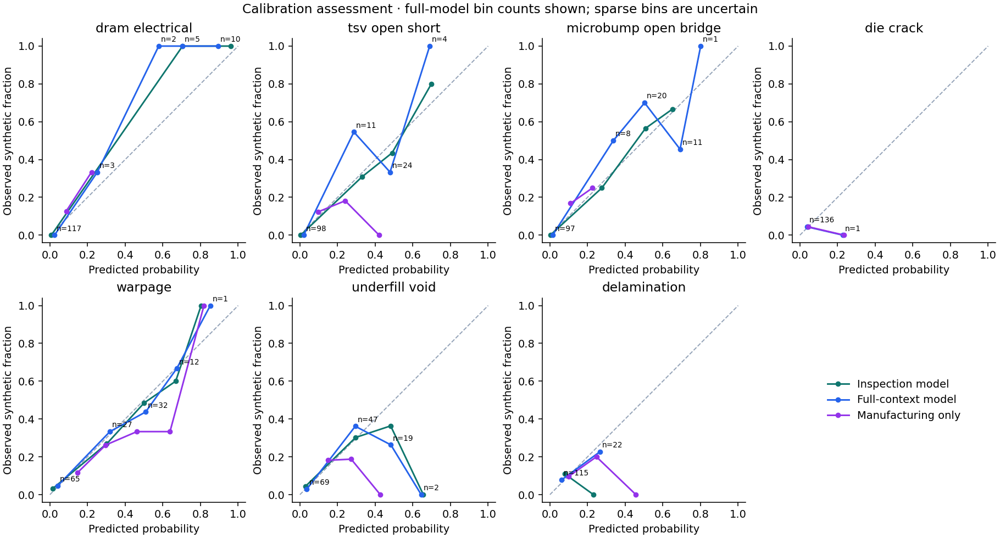
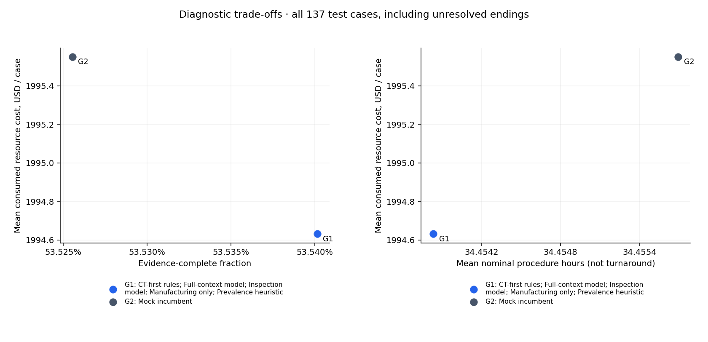
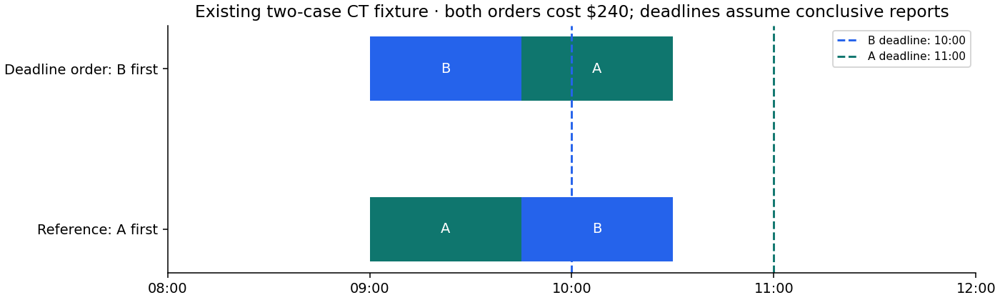

# Helion model pipeline and diagnostic benchmark

**Executed offline research · synthetic data and operating assumptions · retrospective test partition**

## Result and interpretation

The full-context policy consumed **$1,994.63 per test case**, compared with **$1,995.55 for the mock incumbent** and **$1,994.63 for the CT-first rules comparator**. Its evidence-complete fraction was **53.5%**, compared with **53.5%** and **53.5%**, respectively. These are bounded-replay outcomes, including unfinished investigations—not measured fab savings or the cost of completing every investigation.

The full-context policy changes consumed cost by **-0.92 USD** and the complete fraction by **+0.01 percentage points** against the mock baseline. Judge these jointly with diagnostic errors and uncertainty below. No operating winner or production release is selected.

**The full-model and CT-first rules arms have identical aggregate cost, completion, error and nominal-duration outcomes in the base test replay. This benchmark therefore demonstrates no incremental diagnostic value from the model over that simple rules comparator.**

## Evidence and design boundary

- Supplied cohort: 916 synthetic rejected stacks; 653 train, 126 validation, 137 test. The seven simulator indicators are synthetic reference labels, not procedure findings.
- Test evidence includes six die-crack cases and two cases with coexisting faults. Test data had previously been inspected; this is retrospective evaluation.
- The original acceptance-failure benchmark targets a different decision and remains unchanged. It is not compared numerically with seven-fault prediction.
- MOCK-ENG-001 supplies the invented SOP comparator; SYN-OPS-001 supplies invented staff, dollar rates and report-error assumptions. Neither is validated Helion practice.
- Procedure histories, diagnostic effort, real audit membership and live calendars were not supplied. Newly generated records are explicitly simulated. 40 of 916 cases were independently assigned to the synthetic audit group, fixed across policies and report replications.
- Existing lot/time partitions are retained. Internal tuning uses the frozen expanding-lot folds with at least 21 days between fitting and scoring lot releases. Source chronology details in `validation.json` distinguish lot-release spacing from observed timestamp gaps; no genuine diagnostic-label availability timestamp exists.

## 1. Does manufacturing context improve fault prediction?

The full-context model does not improve either macro average precision or binary log loss over inspection/acceptance alone in these test point estimates. The full-minus-inspection differences are -0.0072 macro AP and +0.0194 binary log loss; higher AP and lower loss are preferred.

| variant | average_precision | binary_log_loss | brier_score |
| --- | --- | --- | --- |
| full | 0.497 | 0.251 | 0.081 |
| inspection | 0.504 | 0.231 | 0.077 |
| manufacturing | 0.189 | 0.408 | 0.123 |
| prevalence | 0.145 | 0.402 | 0.121 |

One saved artifact contains alternative logistic pipelines with identical fitting protocols. Each has seven binary heads and training-only imputation, indicators, scaling and encoding. A shared C is chosen within training; no reweighting, oversampling or post-hoc calibration was fitted. Raw sigmoid probabilities are assessed rather than presumed calibrated. Per-label results, support, calibration-bin counts and paired full-minus-inspection bootstrap intervals are in the companion CSVs.

Acceptance-derived inputs have substantial synthetic shortcuts: interconnect failures equal the TSV-plus-microbump truth count, acceptance gates are functions of fault subsets, and other acceptance readings depend on generated faults. The manufacturing-only comparison removes the nine acceptance predictors. High performance does not establish real-fab discrimination. `timing_margin_ps`, post-investigation annotations, IDs and simulator internals are prohibited predictors.

## 2. Do predictions improve diagnostic selection beyond rules?

| arm | cost | pending_cost | complete | correctly_complete | unresolved_count | missed_faults | false_absences | false_positives | attempts |
| --- | --- | --- | --- | --- | --- | --- | --- | --- | --- |
| ct_first | 1994.631 | 747.591 | 0.535 | 0.484 | 1.614 | 0.238 | 0.024 | 0.066 | 3.750 |
| full | 1994.631 | 747.591 | 0.535 | 0.484 | 1.614 | 0.238 | 0.024 | 0.066 | 3.750 |
| inspection | 1994.631 | 747.591 | 0.535 | 0.484 | 1.614 | 0.238 | 0.024 | 0.066 | 3.750 |
| manufacturing | 1994.631 | 747.591 | 0.535 | 0.484 | 1.614 | 0.238 | 0.024 | 0.066 | 3.750 |
| mock | 1995.551 | 747.854 | 0.535 | 0.484 | 1.614 | 0.238 | 0.024 | 0.066 | 3.756 |
| prevalence | 1994.631 | 747.591 | 0.535 | 0.484 | 1.614 | 0.238 | 0.024 | 0.066 | 3.750 |

Cost is USD per started case. Complete/correctly-complete columns are fractions; fault and unresolved columns are counts per case. Every case remains in the denominator. Pending cost values currently identifiable unattempted procedures; it is not an estimate of unknown manual review or eventual completion.

The mock baseline performs triggered branches first. CT-first rules use the same safe procedure catalogue but may advance completeness work. The four heuristic arms use prevalence, inspection-only, full-context or manufacturing-only fault probabilities. They share the same evidence requirements, scope restrictions, report draws, audit assignment and one-attempt limit. This separates a simple rule improvement from predictive value.

The heuristic uses (1 − inconclusive probability) × predicted unresolved positive coverage / resource cost, with equal importance weights and 60% gross-delamination coverage for CT. It does not fully value negative findings, model expected continuation cost or establish an optimal sequence. Findings update evidence and eligibility; initial fault probabilities do not become automatically updated posteriors.

The base assumptions explain why changing probabilities may not change the procedure set. CT's delamination contribution is `0.90 × 0.60 × p(D) / 120 = 0.0045 × p(D)`; acoustic's is `0.85 × p(D) / 200 = 0.00425 × p(D)`. CT also receives greater void coverage per dollar and any unresolved warpage contribution. Consequently this particular heuristic ranks an eligible, unattempted CT ahead of acoustic. Learned scores can change other ordering without changing the evidence eventually collected. This is a consequence of the exercise's catalogue and heuristic, not a claim that ML can never help a real lab.

The empirical nondominance table also considers unresolved questions, false absences, false positives, incorrect completion and nominal duration. Point-estimate nondominance is not evidence of statistical superiority. Identical procedure sets cost the same in any eligible order. A true delamination finding is useful; omitting required delamination investigation merely to reduce spending is not an equal-completeness comparator.

### Paired uncertainty against the mock baseline

| arm | metric | paired_mean_difference | lot_bootstrap_low | lot_bootstrap_high | mc_standard_error |
| --- | --- | --- | --- | --- | --- |
| ct_first | cost | -0.920 | -3.170 | 0.000 | 0.190 |
| ct_first | complete | 0.000 | 0.000 | 0.001 | 0.000 |
| ct_first | missed_faults | -0.000 | -0.001 | 0.000 | 0.000 |
| ct_first | incorrectly_complete | 0.000 | 0.000 | 0.000 | 0.000 |
| prevalence | cost | -0.920 | -2.821 | 0.000 | 0.190 |
| prevalence | complete | 0.000 | 0.000 | 0.000 | 0.000 |
| prevalence | missed_faults | -0.000 | -0.000 | 0.000 | 0.000 |
| prevalence | incorrectly_complete | 0.000 | 0.000 | 0.000 | 0.000 |
| inspection | cost | -0.920 | -2.908 | 0.000 | 0.190 |
| inspection | complete | 0.000 | 0.000 | 0.000 | 0.000 |
| inspection | missed_faults | -0.000 | -0.000 | 0.000 | 0.000 |
| inspection | incorrectly_complete | 0.000 | 0.000 | 0.000 | 0.000 |
| full | cost | -0.920 | -2.843 | 0.000 | 0.190 |
| full | complete | 0.000 | 0.000 | 0.000 | 0.000 |
| full | missed_faults | -0.000 | -0.000 | 0.000 | 0.000 |
| full | incorrectly_complete | 0.000 | 0.000 | 0.000 | 0.000 |
| manufacturing | cost | -0.920 | -2.800 | 0.000 | 0.190 |
| manufacturing | complete | 0.000 | 0.000 | 0.000 | 0.000 |
| manufacturing | missed_faults | -0.000 | -0.000 | 0.000 | 0.000 |
| manufacturing | incorrectly_complete | 0.000 | 0.000 | 0.000 | 0.000 |

The 95% percentile intervals use 1,000 paired lot-cluster bootstrap samples. Monte Carlo standard errors describe 100 repeated synthetic report draws on the same cases; they are reported separately. Neither quantifies uncertainty in the invented costs or procedure performance. All-case averages and audit/coexisting slices are supplied; rare slices require particular caution.

### Unresolved paths and truth errors

An inconclusive CT can leave warpage unresolved; electrical isolation can leave DRAM/base questions unresolved; SEM can leave microbump/crack questions unresolved. IR localisation does not resolve a mechanism. Contradictions remain pending review. Independent nondestructive branches may continue, but destructive preparation is not authorised while intact-sample evidence/review remains open. No independent repeat-success draws or free manual resolutions are invented.

An evidence-complete record may still be wrong because reports have synthetic false-positive and false-negative rates. Evaluation therefore uses hidden truth separately. The recommender never receives truth. Audit battery attempts, supported mechanism evidence and review requirements are distinct; an inconclusive audit is not a complete operational reference.

## 3. Can dispatch improve the existing scheduling example?

In Case D, A-first misses B's 10:00 scoped milestone; B-first meets both milestones if conclusive. **Both orders cost $240.** Actual incumbent dispatch is unknown. These two cases demonstrate timing feasibility, not a quarterly turnaround gain. Staff phases, equipment occupancy and sample conflicts are checked, not merely machine availability.

Case A schedules CT 09:00–09:45 for $120. Case B schedules acoustic 09:00–10:30 and electrical isolation 12:00–16:00; with its prior $120 CT the illustrated cumulative cost is $920. SEM remains pending because the calendar ends at 24 hours. The $2,720 conclusive Case C path is a conditional nominal evidence/cost trace, not a future appointment. A stale calendar prevents new slot promises.

## Sensitivity and reproducibility

All six policies are replayed for all three partitions under base assumptions. Numerical stresses are evaluated on the test partition with paired report draws: staff/equipment rates ×0.75/1.25 (supplies unchanged), q ±0.05, sensitivity −0.05 and specificity −0.02. Scheduling separately tests a 2/4-hour extension of the existing CT outage. These are assumption stresses, not confidence intervals. Correlated report errors and narrower real examination scope remain qualitative limitations; no new distributions were invented.

Read `decision_metrics.csv` for base and stress outcomes, `replay_cases.parquet` for every case/arm/replication summary, and `replay_events.jsonl.gz` for every base-run recommendation and report. Stress reports are reproducible from recorded seeds and configuration. `run_manifest.json` records source/code checksums, dependencies and stage status. The single `model.joblib` must only be loaded from this trusted local run.

## Operational boundary and next evidence

These dollar values measure consumed resource capacity, not entirely avoidable cash. No salaries, equipment depreciation or full system ownership costs are claimed as cash savings. Queue delays are not monetised. Nominal procedure-hour totals are not actual turnaround time; no future roster or whole-cohort arrivals are fabricated.

No model release is qualified. The remaining evidence is the actual SOP/closure/repeat standard, representative complete audits, qualified diagnostic coverage and performance, observed operating costs, and fresh prospective comparisons. The independent 1-in-20 audit policy remains necessary; approximately 45 cases per quarter gives limited rare-mechanism evidence. Existing metrology sampling is unchanged. A valid recommendation remains to retain the rules if incremental ML value cannot be established.
