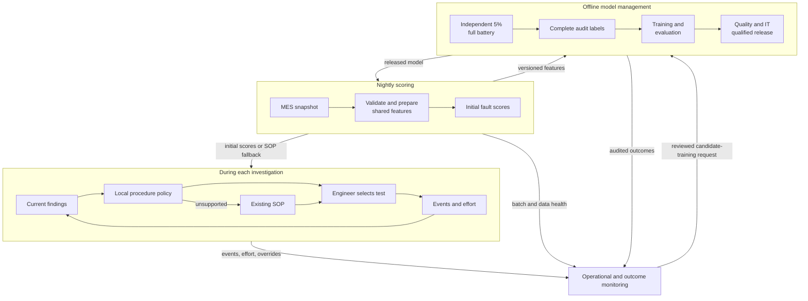

# Viva Pre-Read: Helion Semiconductor

**Team:** Group 8. **Members:** team to complete.  
**Scenario:** rejected-stack diagnostic selection, air-gapped fab.  
**Pipeline/extras:** no build or deployment. Design reasoning only.

Proposed design below. Evidence and worked explanations: [completed notebook](P1_ml_systems_helion.ipynb).

## A. Design blueprint

- [x] **Problem:** Seven fault probabilities guide the next procedure. Beat incumbent rules on engineer hours at unchanged completeness because diagnosis serves process engineering. [Brief](../../problem-statement/helion_semiconductor_client_brief.md)
- [x] **Cost of error:** Missed co-faults misdirect investigations. Extra tests consume resources. Cost ratio unknown. Engineer-controlled completeness overrides ranking; probabilities never authorise stopping.
- [x] **Data:** Version MES snapshots; validate keys, ranges and availability. Share preprocessing to prevent skew. The 916 synthetic rejected cases lack procedure history, effort and audit flags. [Evidence](../../README.md)
- [x] **Training:** Propose regularised multilabel logistic regression, shared preprocessing and seven outputs. Version configuration, audited labels, splits, dependencies and seeds for reproducibility.
- [x] **Evaluation:** Preserve lot/time splits; prohibit outcome annotations. Compare hours and completeness against equal-input rules, including product/tool and co-fault slices because aggregates hide failures. Pool expected ~45 complete audits/quarter because rare-fault evidence is sparse. [Audit premise](../../problem-statement/helion_semiconductor_client_brief.md)
- [x] **Serving:** Nightly local scores fit MES timing. Findings immediately update procedure ranking, preserving initial probabilities. Pin offline dependencies and release hashes for qualification. [Constraints](../../problem-statement/helion_semiconductor_client_brief.md)
- [x] **Monitoring:** Watch batch health, inputs and audit findings. Confirmed model-related drift or qualified process change triggers candidate retraining with approved versioned data/protocol. Reviewed promotion protects operations.
- [x] **Deliberately lean:** CPU batch and local records limit maintenance for four engineers. Invest complexity in evidence, fallback and qualification. [Ownership](../../problem-statement/helion_semiconductor_client_brief.md)

### Architecture sketch

Offline viewing: [diagram image](images/helion-architecture.png) and [editable Mermaid source](images/helion-architecture.mmd).

## B. Key reasoning

**1. Framing & fit:** Predict coexisting mechanisms to support procedure selection. Selective labels and the air gap determine the design. ML value remains unproved. [Brief](../../problem-statement/helion_semiconductor_client_brief.md)

**2. Cost & metric:** False negatives can conceal second faults; false positives add procedures. Measure hands-on hours subject to approved completeness. No automatic 0.5 cutoff or invented cost ratio.

**3. Data & leakage:** Post-investigation `defect_type` leaks findings. Enforce a checkpoint allowlist and availability audit. Exclude synthetic `timing_margin_ps`; untested labels stay unknown. [Evidence](../../README.md)

**4. Serving fit:** Batch inference matches nightly arrivals; local policy responds to findings. Frequent actionable measurements could justify online inference, subject to qualification.

**5. Monitoring & loop:** A shifted void distribution indicates data drift; changed fault risk at similar inputs indicates concept drift. Overrides/repeats are late-label proxies. Apply A's retraining gate. Independent audits counter selection feedback.

**6. Trade-offs:** Validation/testability protects evidence, reliability supports night shifts, observability exposes failures. Under-invest in model complexity, accepting missed nonlinear relationships until simpler choices justify expansion.

## C. Before you submit

- [x] Eight reasoned decisions, diagram, six answers and [notebook](P1_ml_systems_helion.ipynb).
- [ ] Team supplies member names, optionally adds personal reflections, and rehearses individual defence.
- [ ] Submit both files the day before the viva. [Rubric](../../problem-statement/PRESENTATION_RUBRIC_APPRENTICE.md)
