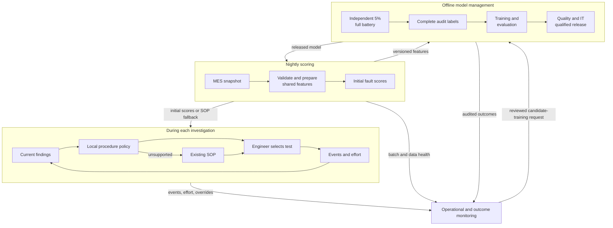

# Helion diagnostic-selection presentation

**Audience:** apprentice team and mentors. **Team:** Group 8, member names to be supplied.  
**Format:** eight slides, 10 minutes, followed by individual viva questions. This is a complete Markdown outline with speaker notes, not a generated slide deck. The [completed notebook](P1_ml_systems_helion.ipynb) is the detailed source of truth. The proposal has no trained model or measured savings.

| Slide | Topic | Duration | Elapsed |
|---|---|---:|---:|
| 1 | Business objective and engineer decision | 0:45 | 0:45 |
| 2 | Existing workflow and baseline | 1:00 | 1:45 |
| 3 | Available data and evidence gaps | 1:15 | 3:00 |
| 4 | Model and next-procedure policy | 1:30 | 4:30 |
| 5 | Coexisting faults and stopping rules | 1:15 | 5:45 |
| 6 | Evaluation and economics | 1:45 | 7:30 |
| 7 | Architecture, monitoring and fallback | 1:30 | 9:00 |
| 8 | Trade-offs, limitations and next step | 1:00 | 10:00 |

The timings include short pauses for the policy and architecture. Speaker notes are a script for rehearsal, not text to place on slides. Evidence references are reading aids and need not be spoken. Assign presenters before rehearsal, but everyone should be able to explain every slide. [Assessment format](../../problem-statement/PRESENTATION_RUBRIC_APPRENTICE.md)

## Slide 1: The engineer's next diagnostic decision

**Time:** 0:00–0:45. **Key message:** The proposed value is less diagnostic effort at unchanged completeness.

**On screen**

- One case: an HBM stack that already failed acceptance testing
- One decision: which additional diagnostic procedure to run next
- Engineer owns procedure choice and investigation closure
- Success: lower diagnostic effort with complete, useful findings

**Speaker notes**

Helion investigates around 900 rejected stacks each quarter. Acceptance testing has already happened, and the stack will be scrapped. The useful outcome is a diagnosis that helps process engineering understand what failed. Our system would support the quality engineer's next diagnostic choice. We propose seven fault probabilities because multiple faults can coexist. The engineer remains responsible for choosing procedures and deciding whether the evidence meets the existing completeness standard. We must demonstrate lower investigation effort at that same standard. At present, we have a design proposal and synthetic data, with no demonstrated savings.

**Evidence:** [Brief, Business Context and Objective](../../problem-statement/helion_semiconductor_client_brief.md), [notebook context](P1_ml_systems_helion.ipynb#helion-context). **Rubric:** 1, framing and fit.

## Slide 2: The current investigation workflow

**Time:** 0:45–1:45. **Key message:** Existing rules are the baseline, and their diagnostic obligations remain authoritative.

**On screen**

1. Acceptance failure and initial measurements
2. Engineering rules choose a procedure
3. Findings determine further testing
4. Engineer closes under the qualified standard

| Procedure example | Brief's duration | Inconclusive |
|---|---:|---:|
| X-ray / CT | 45 minutes | 10% |
| Electrical fault isolation | 4 hours | 20% |
| Cross-section / SEM | 2 days, destructive | 5% |

**Speaker notes**

The existing rules already use strong measurements, including warpage and void readings. They are written down and useful. We must compare our proposal with those rules using the same inputs. Engineers currently choose a diagnostic path, rather than running every test. Procedures differ in coverage and duration. X-ray takes forty-five minutes in the brief, while electrical isolation takes four hours. Cross-section takes two days and destroys the sample. Those durations are not interchangeable with engineer labour. We first need the actual procedure dependencies and stopping standard. If every mandatory procedure still runs, changing the order cannot reduce their summed effort. Savings require a justified change in optional work or a separately measured operational delay.

**Evidence:** [Brief, procedure table, incumbent rules and constraints](../../problem-statement/helion_semiconductor_client_brief.md), [notebook policy](P1_ml_systems_helion.ipynb#helion-policy). **Rubric:** 1, framing; 2, cost and metrics.

## Slide 3: Available evidence and missing diagnostic records

**Time:** 1:45–3:00. **Key message:** The files support a synthetic design illustration, while production value needs additional evidence.

**On screen**

| Verified in supplied files | Required operational evidence |
|---|---|
| 17,793 stacks, 916 rejected | Procedure events and findings |
| Seven synthetic mechanism labels | Hands-on effort, equipment and elapsed time |
| 653 / 126 / 137 rejected train/validation/test cases | Independent complete-audit membership |
| 21 rejected stacks with coexisting faults | Qualified procedure coverage and completeness standard |

- Post-investigation annotations and simulator internals cannot be predictors
- Unmeasured input and uninvestigated mechanism require different handling

**Speaker notes**

The supplied files contain 916 rejected stacks, with seven mechanism labels from the simulator. Twenty-one have multiple faults. The existing partitions contain 653 training, 126 validation and 137 test cases. These are synthetic facts, not production evidence. Procedure history, diagnostic hours and full-battery membership are absent. Therefore we cannot calculate actual savings from these files. We preserve the lot and time partitions because related stacks share process conditions. Initial acceptance observations can be inputs at this decision point. Later defect annotations cannot, because they reveal findings the engineer has not obtained yet. We initially exclude the synthetic timing-margin shortcut. Missing measurements need their reasons and coverage preserved. An uninvestigated fault remains unknown. Filling it with zero would teach the model that a test nobody chose to run proved absence.

**Evidence:** [README, cohort and input boundary](../../README.md), [notebook verified evidence](P1_ml_systems_helion.ipynb#helion-evidence), [notebook data design](P1_ml_systems_helion.ipynb#helion-data). **Rubric:** 3, data and pipeline reasoning.

## Slide 4: Fault probabilities and procedure ranking

**Time:** 3:00–4:30. **Key message:** A small model estimates faults, and a separate policy proposes the next eligible procedure.

**On screen**

- Candidate: one regularised logistic model with seven probability outputs
- Mandatory steps, dependencies and evidence preservation come first
- Rank eligible unperformed nondestructive procedures by unresolved coverage and time
- Findings change the procedure ranking immediately

\[
R(t)=\frac{(1-q_t)\sum_{m\in U\cap C_t}p_m}{d_t}
\]

`U`: unresolved mechanisms. `C_t`: qualified coverage of procedure `t`. `q_t`: inconclusive rate. `d_t`: stated procedure duration in comparable units. **Illustrative heuristic requiring evaluation.**

**Speaker notes**

Our initial candidate is regularised logistic regression with shared preprocessing and seven outputs in one model artifact. Regularisation limits how strongly a small training set can push the coefficients. Each output estimates one mechanism's probability. They need not sum to one, and independent outputs do not capture joint fault probabilities. A separate policy checks mandatory steps and dependencies before ranking eligible procedures. Its illustrative score adds initial probabilities for unresolved mechanisms a test can settle, discounts by the chance of an inconclusive result, and divides by comparable procedure duration. This is a coverage heuristic. It does not measure information gain or detection sensitivity. Equal weights are a proposal for shadow evaluation. X-ray receives delamination credit only within a qualified gross-delamination scope. Findings change investigation state and eligible procedures without refitting or updating model probabilities. Destructive cross-section follows a gated escalation. Missing approved coverage, dependencies or duration means fallback. The interface shows the proposed procedure, its reason, unresolved mechanisms and the existing-rules alternative.

**Evidence:** Model and ranking are proposed design choices in the [notebook policy](P1_ml_systems_helion.ipynb#helion-policy). Procedure durations and inconclusive rates come from the [brief](../../problem-statement/helion_semiconductor_client_brief.md). **Rubric:** 1, framing; 2, metric choice; 6, trade-offs.

## Slide 5: Coexisting faults and investigation closure

**Time:** 4:30–5:45. **Key message:** A confirmed first fault never settles another mechanism.

**On screen**

| Mechanism state | Consequence |
|---|---|
| Untested | Remains unresolved |
| Confirmed present | Record qualified evidence |
| Confirmed absent | Record qualified exclusion evidence |
| Inconclusive | Remains unresolved, follow SOP alternative or escalation |

**Illustrative case:** confirmed TSV open, microbump mechanism still unresolved.  
**Closure:** engineer applies the existing qualified completeness standard. There is no autonomous STOP action.

**Speaker notes**

Consider an illustrative case where electrical isolation confirms a TSV open. The microbump mechanism remains unresolved. Finding one explanation cannot erase another possible fault, and a low probability cannot establish absence. We track every mechanism as untested, confirmed present, confirmed absent or inconclusive. Only qualified evidence establishes presence or absence. Thermal imaging can help locate an electrical issue, but localisation alone cannot exclude a fault. An inconclusive test leaves uncertainty and invokes the approved alternative or escalation instead of an endless retry loop. The engineer closes the investigation under the existing completeness standard and records supporting evidence. We do not yet have that standard's exact thresholds or permitted omissions. They are prerequisites for release. The user interface must keep unresolved mechanisms visible even after the first positive finding, especially for a new engineer working overnight.

**Evidence:** Coexistence and premature stopping are explicit in the [brief](../../problem-statement/helion_semiconductor_client_brief.md). The four states and interface behaviour are proposed in the [notebook policy](P1_ml_systems_helion.ipynb#helion-policy) and [worked cases](P1_ml_systems_helion.ipynb#helion-worked-cases). **Rubric:** 2, cost of error; 7, defence through cases.

## Slide 6: Evaluation and diagnostic economics

**Time:** 5:45–7:30. **Key message:** A controlled study must establish useful savings without losing diagnostic completeness.

**On screen**

- Primary outcome: hands-on diagnostic hours per eligible rejected case
- Guardrails: missed mechanisms, co-fault misses, unresolved cases, repeats and overrides
- Equal-input comparison against incumbent rules and procedure order
- Independent complete audits provide the reference findings
- Approximately 45 audits per quarter limit rare-fault claims

\[
\text{Net benefit}=\text{baseline diagnostic cost}-\text{assisted diagnostic cost}-\text{incremental overhead}
\]

**Same cohort and period. No measured savings available.**

**Speaker notes**

Our primary outcome is mean hands-on engineer diagnostic hours per eligible rejected stack, subject to the client's approved completeness requirement. We report missed mechanisms and coexisting faults alongside unresolved cases, repeated tests and overrides. Unclosed investigations remain in the accounting with effort to date. Equipment time, turnaround and financial cost have separate units. Monetary rates remain unknown. The complete diagnostic battery supplies reference findings for one in twenty rejected stacks. At 900 per quarter, that is about 45 audits. Rare faults and coexisting faults will have very small counts, so we pool audit history and report uncertainty with lot grouping. We initially use representative audits for operational fitting and evaluation. Selectively tested labels remain biased even if we mask unknown entries. Shadow mode can check feasibility but cannot prove causal time savings. A later controlled pilot, allocated by lot with process changes considered, compares assisted decisions with incumbent practice. Before the pilot, the client must approve the completeness margin and economics protocol. If the study cannot support the required completeness claim, deployment waits. A higher classification score alone does not establish business value.

**Evidence:** Audit frequency and business requirement: [brief](../../problem-statement/helion_semiconductor_client_brief.md). The 45 count is `900 ÷ 20`. Endpoints, uncertainty and pilot design: [notebook evaluation](P1_ml_systems_helion.ipynb#helion-evaluation). **Rubric:** 2, metrics; 3, data reasoning; 6, prioritisation.

## Slide 7: Operation inside the fab

**Time:** 7:30–9:00. **Key message:** Nightly scoring and a local decision interface fit the fab's data cadence and support requirements.

**On screen**

Offline viewing: [diagram image](images/helion-architecture.png) and [editable Mermaid source](images/helion-architecture.mmd).

**Proposed defaults:** failed batch at handover or unqualified process conditions trigger visible SOP fallback. An audit-confirmed missed co-fault potentially attributable to the recommendation suspends the affected policy for review.

**Speaker notes**

Read the diagram from the nightly MES import. Validation and shared feature preparation feed batch scores inside the air-gapped fab. The local interface combines those scores with the current investigation state. Each diagnostic event updates that state immediately and leaves an audit trail. Separately selected complete audits feed evaluation and future training, which helps prevent the recommendation policy from choosing its own apparent ground truth. Monitoring covers operational failures, changed inputs and eventual diagnostic outcomes. Overrides and repeated procedures provide early signals while labels are delayed. A failed batch at handover triggers visible fallback. A new unqualified tool or material sends affected cases to existing rules and qualification review. Confirmed model-related drift or a qualified process change can trigger candidate retraining once owners approve versioned data and the evaluation protocol. Quality and IT review promotion. Pinned offline dependencies, release hashes and rollback make the proposal supportable by the existing team.

**Evidence:** Air gap, MES cadence, qualification and team capacity: [brief](../../problem-statement/helion_semiconductor_client_brief.md). Architecture and exact proposed monitoring defaults: [notebook operations](P1_ml_systems_helion.ipynb#helion-operations). **Rubric:** 4, serving; 5, monitoring and feedback.

## Slide 8: Priorities and readiness for the next step

**Time:** 9:00–10:00. **Key message:** The next justified action is collecting the missing evidence while retaining the established workflow.

**On screen**

- Priorities: validation/testability, reliability and observability
- Deliberate limits: small model, CPU batch, local records
- Readiness gates: event logs, qualified coverage, completeness standard and independent audits
- Proposed sequence: retain SOP, establish evidence, qualified shadow study, controlled pilot
- Keep existing rules if they provide comparable value

**Speaker notes**

We prioritise validation and testability because weak evidence can produce convincing but misleading results. Reliability matters for night shifts, and observability helps four engineers understand failures. We accept limited nonlinear modelling and joint-fault modelling in the initial candidate. More complex models would need evidence of worthwhile gains. We have not demonstrated that Helion needs ML. The next step is to retain the standard procedure, define qualified coverage and completeness, and collect versioned diagnostic events with independent audits. A qualified shadow study follows when those inputs exist. A controlled pilot requires stronger evidence and approval. If the existing rules achieve comparable value, retaining them is the recommendation we should defend.

**Evidence:** [Brief constraints](../../problem-statement/helion_semiconductor_client_brief.md), [notebook blueprint](P1_ml_systems_helion.ipynb#helion-blueprint), [rubric dimensions 6 and 7](../../problem-statement/PRESENTATION_RUBRIC_APPRENTICE.md). **Rubric:** 6, trade-offs; 7, honest defence.

## Rehearsal and viva handoff

Use the [viva preparation](viva_preparation.md) for individual practice. In rehearsal, every team member explains the architecture and answers one alternative-design question. Keep the policy's initial probabilities distinct from current diagnostic findings. Be ready to explain why complete audits, preservation of co-faults and prospective evidence limit the claims the team can make. Personal reflections and actual experiences must come from the team.
