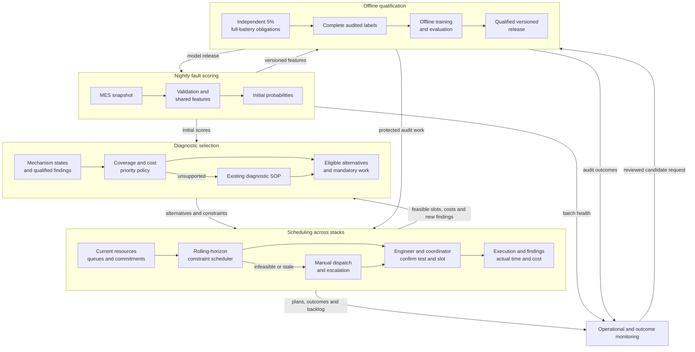

# Viva Pre-Read: Helion Semiconductor

**Team:** Group 8; members to complete. **Status:** design only; no measured savings.

**Scope:** Original brief: one model, one next-test decision. User expansion, 21 September 2026: integrate shared-resource scheduling; course/client approval remains unconfirmed. [Brief](../../problem-statement/helion_semiconductor_client_brief.md)

## A. Design blueprint

- [x] **Problem:** Minimise expected operational cost across diagnostically adequate investigations, subject to completeness, safety, resource feasibility and approved turnaround/maximum-wait constraints. Selection and scheduling are coordinated decisions.
- [x] **Cost of error:** Missed co-faults undermine findings; unnecessary tests waste resources. Completeness, evidence preservation and anti-starvation rules override cheap-test priority. Engineer approves closure.
- [x] **Data:** Version MES snapshots and shared preprocessing. The 916 synthetic rejects lack diagnostic history, effort, audit flags and scheduling records. Collect resource calendars, queues, skills, setups, batching, dependencies and deadlines. [Evidence](P1_ml_systems_helion.ipynb#helion-evidence)
- [x] **Training:** One regularised multilabel logistic candidate produces seven initial probabilities. Preserve lot/time splits; version labels, transformations, configuration and dependencies. Scheduler uses deterministic constraints, not another learned model.
- [x] **Evaluation:** Compare incumbent/new selection crossed with current/new scheduling under equal workloads, resources and completeness. Report cost, labour, equipment use, turnaround, overdue cases and co-fault misses separately. Include pending obligations; deferment is not savings.
- [x] **Serving:** Nightly scores; live local findings/resources drive rolling-horizon replanning. Policy supplies eligible alternatives; scheduler returns feasible slots and cost estimates. Engineer/coordinator approves dispatch. Preserve started work and frozen commitments.
- [x] **Monitoring:** Track data/resource freshness, queue age, deadline misses, overrides, audits and drift. Protect independent audit slots. Retraining creates reviewed candidates; supplier/tool changes trigger qualification review.
- [x] **Deliberately lean:** CPU inference and a local scheduler suit the air gap; added coordination/qualification overhead must earn its keep. Retain SOP/manual dispatch when unsupported. [Constraints](../../problem-statement/helion_semiconductor_client_brief.md)

### Architecture sketch

[Diagram image](images/helion-architecture.png) · [Mermaid source](images/helion-architecture.mmd)

## B. Key reasoning

**1. Framing & fit:** Seven probabilities need not sum to one. Select evidence per stack, then allocate shared equipment. Scheduling benefit alone does not establish ML value.

**2. Cost & metric:** Rank eligible tests by weighted unresolved positive-fault coverage, discounted by inconclusiveness, per comparable incremental cost. This heuristic undervalues negative findings. Never add hours, money and destructiveness directly; absent rates, report resource/time measures separately.

**3. Data & leakage:** Exclude post-investigation annotations, simulator internals and synthetic `timing_margin_ps`. Untested/inconclusive mechanisms remain unresolved. Roughly 45 complete audits/quarter limit rare-fault evidence. [Premise](../../problem-statement/helion_semiconductor_client_brief.md)

**4. Serving fit:** New results, arrivals, outages and overruns replan future work using current local status. Infeasible deadlines escalate; stale resources stop automated slot promises.

**5. Monitoring & loop:** Independent audits counter selective labels. Audit membership survives scheduling pressure. Monitor complete-cohort outcomes and pending effort; validate comparisons across shared-resource time blocks.

**6. Trade-offs:** Validation, reliability and observability outrank complexity. Neither an inconclusive test nor a first confirmed fault authorises stopping. Missing dependencies/costs require manual coordination.

## C. Before submission

- [x] Eight decisions, six answers, diagram; detail in [notebook](P1_ml_systems_helion.ipynb).
- [ ] Supply names, rehearse, confirm expanded scope; submit the day before. [Rubric](../../problem-statement/PRESENTATION_RUBRIC_APPRENTICE.md)
