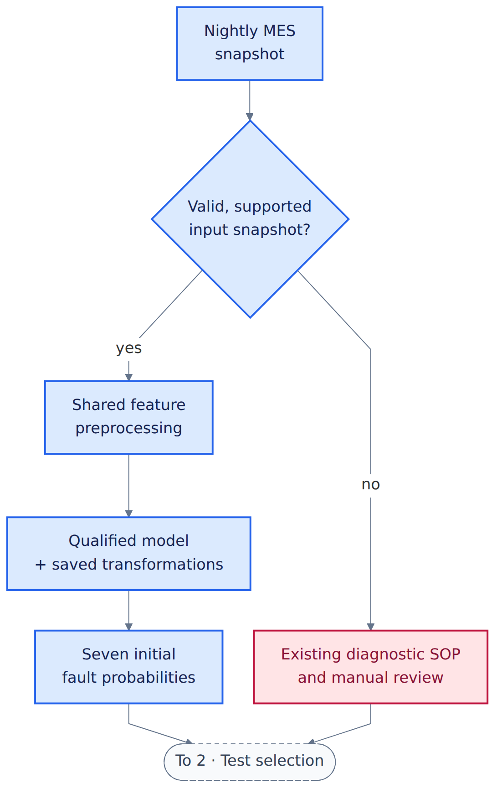
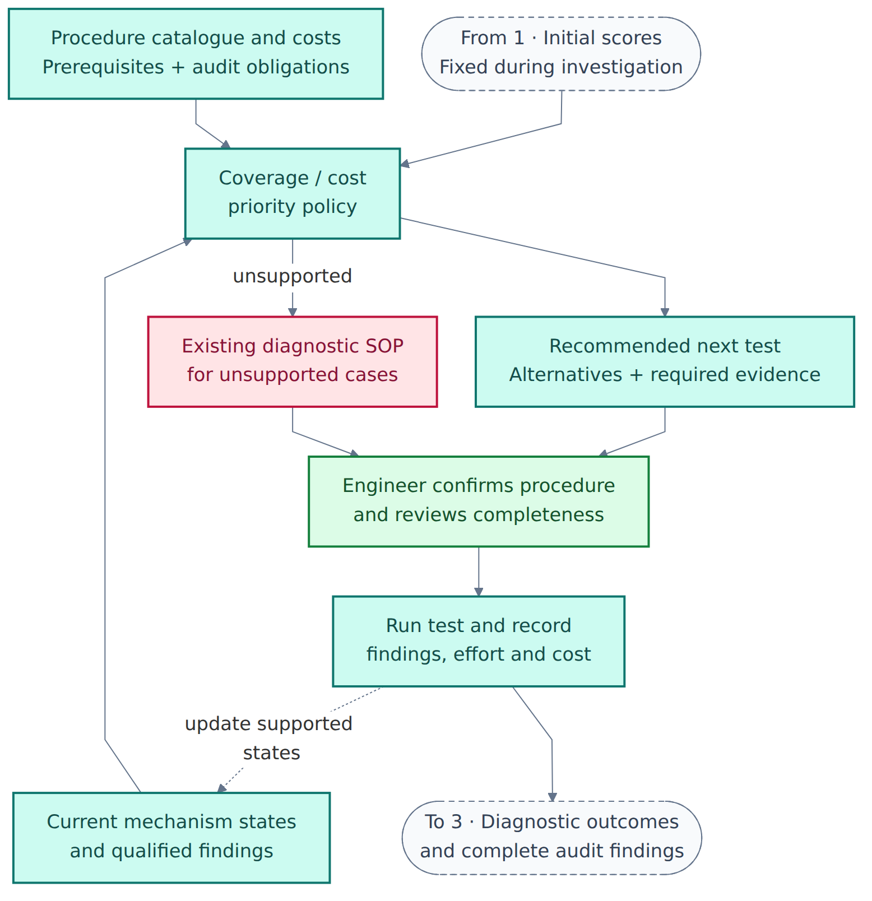
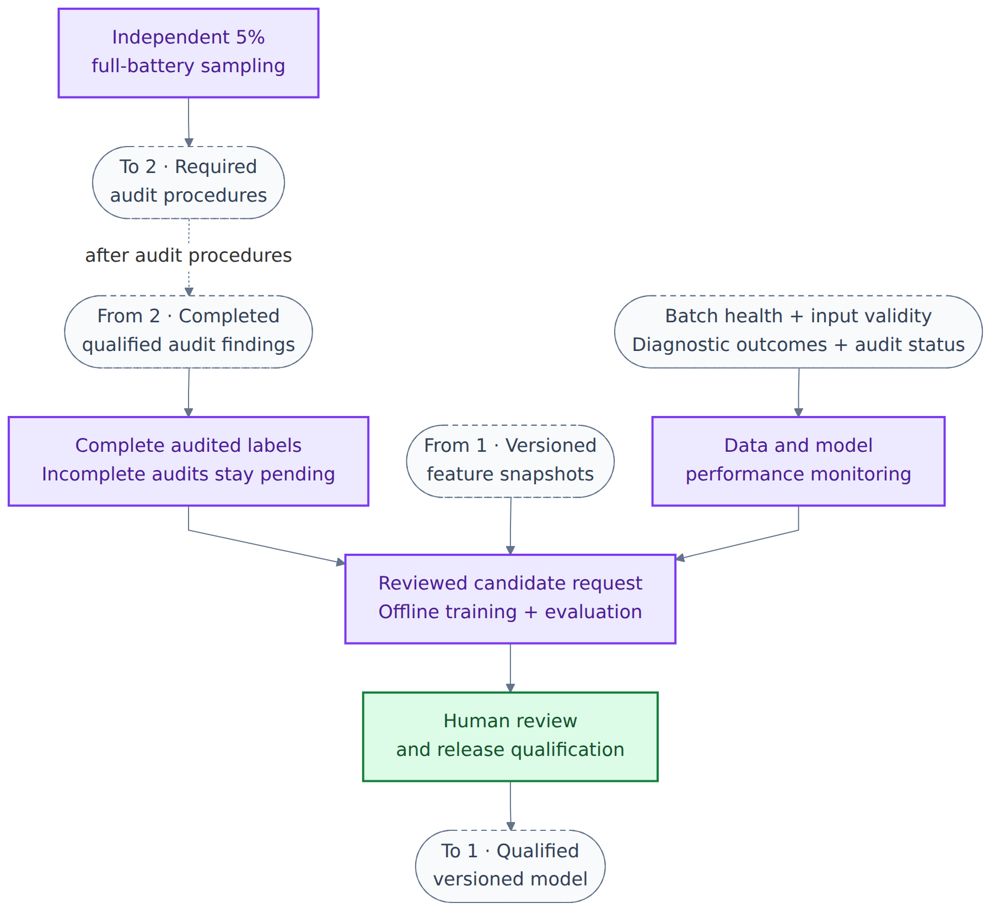

# Helion architecture — separated views

These diagrams show the proposed fab workflow from the [design blueprint](P1_ml_systems_helion.ipynb#helion-blueprint). The implemented offline research package and its operational boundaries are described in the [pipeline README](../helion_pipeline/README.md#pipeline-and-evidence-boundaries).

## Overview

[Editable Mermaid](images/helion-architecture.mmd) · [Vector SVG](images/helion-architecture.svg)

Blue identifies scoring, teal test selection, purple the improvement loop, green human decisions and rose fallbacks. Numbered handoff boxes connect the three detail views; dashed arrows show feedback or an execution step expanded in another view.

## 1. Nightly scoring

[Editable Mermaid](images/helion-scoring.mmd) · [Vector SVG](images/helion-scoring.svg)

The nightly MES import supplies the initial scoring snapshot. Validation and shared preprocessing precede inference; unsupported inputs route to the existing SOP and manual review. [Data and serving design](P1_ml_systems_helion.ipynb#helion-blueprint)

## 2. Diagnostic test selection

[Editable Mermaid](images/helion-selection.mmd) · [Vector SVG](images/helion-selection.svg)

Findings update mechanism states and eligibility while initial probabilities remain fixed. Mandatory evidence overrides ranking; a first confirmed fault does not authorise closure. [Diagnostic policy](P1_ml_systems_helion.ipynb#helion-policy)

The engineer confirms the next test, records the result and reviews closure against the required diagnostic standard. Each result updates the evidence used for the next recommendation. [Diagnostic interface](P1_ml_systems_helion.ipynb#helion-blueprint)

## 3. Audits, monitoring and improvement

[Editable Mermaid](images/helion-feedback.mmd) · [Vector SVG](images/helion-feedback.svg)

The brief requires independent 1-in-20 full-battery sampling. Audit membership is independent of model recommendations; only complete, qualified findings enter the reference-label cohort. Monitoring supports reviewed candidate training, with human qualification before release. [Audit premise](../problem-statement/helion_semiconductor_client_brief.md) · [Monitoring and release design](P1_ml_systems_helion.ipynb#helion-operations)
