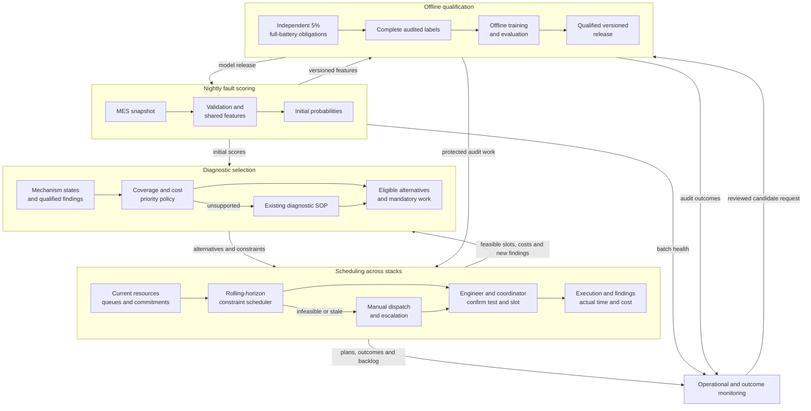

# Helion diagnostic-selection and scheduling presentation

**Audience:** apprentice team and mentors. **Team:** Group 8, member names to be supplied.  
**Format:** eight slides, 10 minutes, followed by individual viva questions. This Markdown outline includes speaker notes, not a generated slide deck. The [completed notebook](P1_ml_systems_helion.ipynb) is the detailed source of truth. No model, simulator or scheduler has been implemented for this design. The examples below demonstrate assumptions and arithmetic, without establishing performance or savings.

**Scope provenance:** The original [client brief](../problem-statement/helion_semiconductor_client_brief.md) specifies one model and one next-test decision. The user requested shared-resource scheduling on **21 September 2026**. This proposal incorporates that expansion without implying course or client approval. The [mock rules](mock_engineering_inspection_rules.md) and [synthetic operating assumptions](../synthetic-data-assumptions/operation-assumptions/synthetic_operating_assumptions.md), version `SYN-OPS-001`, make the demonstration concrete. They do not supply the missing real SOP or operational evidence.

| Slide | Topic | Duration | Elapsed |
|---|---|---:|---:|
| 1 | Objective and decision ownership | 0:45 | 0:45 |
| 2 | Workflow and mock comparator | 1:00 | 1:45 |
| 3 | Evidence and operating assumptions | 1:15 | 3:00 |
| 4 | Fault predictions, outcomes and dollar costs | 1:30 | 4:30 |
| 5 | A feasible two-stack schedule | 1:15 | 5:45 |
| 6 | Evaluation at equal diagnostic completeness | 1:45 | 7:30 |
| 7 | Local operation, monitoring and fallback | 1:30 | 9:00 |
| 8 | Trade-offs and evidence needed next | 1:00 | 10:00 |

Timings total **600 seconds**, including pauses for calculations and architecture. Speaker notes guide rehearsal. Evidence references need not be spoken. Assign presenters, but everyone should be able to defend each decision. [Assessment format and seven dimensions](../problem-statement/PRESENTATION_RUBRIC_APPRENTICE.md)

## Slide 1: Diagnostic selection and shared resources

**Time:** 0:00–0:45. **Key message:** Minimise expected completion cost while meeting the same diagnostic requirements.

**On screen**

- Next procedure for each rejected stack
- Equipment, qualified staff and start time across stacks
- Completeness, evidence preservation and resource feasibility remain constraints
- Engineer owns diagnosis and closure. Shift coordinator owns dispatch.

**Speaker notes**

Helion investigates roughly 900 rejected stacks each quarter. We propose helping the engineer choose the next diagnostic procedure, then coordinating shared staff and equipment. The objective is lower expected investigation cost at unchanged diagnostic completeness, with turnaround reported separately. A real coexisting fault is a useful finding even when it adds work. Comparing a complete investigation with a cheaper incomplete one would misstate value. The engineer approves procedures and closure. A coordinator or designated shift lead approves dispatch. These are proposed responsibilities. Our synthetic operating scenario makes decisions calculable, but establishes neither savings nor readiness for production.

**Evidence:** Volume and objective: [brief](../problem-statement/helion_semiconductor_client_brief.md). Expanded scope: user request, 21 September 2026. Proposed design: [notebook context](P1_ml_systems_helion.ipynb#helion-context). **Rubric:** 1, framing and fit.

## Slide 2: Workflow and mock comparator

**Time:** 0:45–1:45. **Key message:** The exercise now has an explicit comparator with independently tracked fault questions.

**On screen**

1. Acceptance rejection and initial observations
2. Eligible procedure, feasible appointment and scoped findings
3. Updated mechanism states and engineer review

**Mock fixed priority:** CT, acoustic, electrical isolation, conditional IR, then SEM.

**Mock closure:** all seven mechanisms have supported present/absent findings, with no unresolved contradictions. Otherwise retain partial status.

**Speaker notes**

Acceptance testing has already rejected the stack, which will be scrapped regardless. Diagnostic findings inform process investigation without themselves proving which machine or recipe caused the defect. The real brief describes inspection rules and fixed order but omits the full SOP. Our invented comparator supplies explicit thresholds, eligible-test priority and a conservative all-seven closure rule. Its order is CT, acoustic, electrical isolation, conditional IR and SEM. An electrical trigger creates an obligation, not universal electrical-first precedence. After every report, update only examined mechanisms. A TSV finding leaves microbump unresolved. Preserve required intact-sample evidence before destructive work. A CT negative about gross delamination cannot exclude finer delamination. Actual deployment still requires the real qualified standard.

**Evidence:** [Brief workflow and procedures](../problem-statement/helion_semiconductor_client_brief.md), [mock rules §§2–5](mock_engineering_inspection_rules.md), [workflow walkthrough](workflow_walkthrough.md). **Rubric:** 1, baseline; 2, cost of incomplete diagnosis.

## Slide 3: Evidence and operating assumptions

**Time:** 1:45–3:00. **Key message:** The scenario fills demonstration inputs while the production evidence gaps remain open.

**On screen**

| Verified in supplied files | Invented for the demonstration |
|---|---|
| 916 rejected stacks and seven synthetic fault labels | 8 technicians and 8 diagnostic engineers |
| 653 / 126 / 137 train/validation/test rejects | Skills, shift calendars and existing reservations |
| 21 stacks with coexisting faults | Dollar rates, task phases and test sensitivity/specificity |

- Four Yield Engineering system owners come from the brief, separate from invented lab staff
- Still missing: actual diagnostic history, effort, audit membership and qualified SOP
- Preserve lot/time splits and missingness reasons. Exclude simulator internals and later annotations.

**Speaker notes**

The files contain 17,793 stacks, including 916 rejects and 21 rejects with coexisting faults. Their synthetic labels do not establish actual diagnostic performance. Our new scenario adds eight shared technicians and eight diagnostic quality engineers, separate from the brief's four Yield Engineering system owners. It specifies practical capacity, skills, a one-day roster and existing reservations. Headcount alone does not guarantee qualified staff for a particular appointment. Neither the roster nor invented outcome rates replace missing operating history. Preserve the existing lot and time splits. Exclude post-investigation annotations, simulator internals and the synthetic timing-margin shortcut. Retain reasons for missing measurements. Untested diagnostic labels stay unknown rather than becoming negatives. Independent full-battery audits remain protected, regardless of model priority or queue pressure. Their membership and complete findings must be collected for real evaluation.

**Evidence:** [README](../README.md), [notebook evidence](P1_ml_systems_helion.ipynb#helion-evidence), [operating assumptions §§1–5](../synthetic-data-assumptions/operation-assumptions/synthetic_operating_assumptions.md). **Rubric:** 3, data and pipeline reasoning.

## Slide 4: Fault predictions, outcomes and dollar costs

**Time:** 3:00–4:30. **Key message:** A fault probability informs the decision, while test performance and resource costs determine its consequences.

**On screen**

| Procedure | Synthetic resource cost per attempt |
|---|---:|
| X-ray / CT | $120 |
| Acoustic microscopy | $200 |
| Electrical isolation | $600 |
| Thermal / IR | $150 |
| Cross-section + SEM | $1,800 |

- One regularised multilabel logistic candidate predicts seven initial fault probabilities
- Cost = technician labour + engineer labour + occupied equipment + supplies
- Illustrative acoustic example: 70% fault prior, 58.225% positive report, 15% inconclusive
- Decision target: immediate cost plus expected remaining cost, among feasible adequate paths

**Speaker notes**

Regularised logistic regression remains our initial candidate because it is simple to inspect. Its seven probabilities can coexist and do not sum to one. Staff availability affects feasible actions rather than changing the underlying fault merely because a shift is busy. The synthetic cost model charges resource consumption. Acoustic microscopy costs thirty-five dollars of technician time, fifty-five of engineer time, ninety of equipment and twenty of supplies, totalling two hundred dollars. These allocations are not equivalent to cash savings. Outcome assumptions are separate: with a seventy-percent delamination prior, ninety-seven-percent sensitivity, ninety-eight-percent specificity conditional on a conclusive examination, and fifteen-percent inconclusiveness, the positive-report probability is 58.225 percent. Reports can be wrong. None of these numbers came from training. The earlier coverage-per-cost score remains an unvalidated heuristic. In walkthrough Case B, the mock rules already choose acoustic first, so the same recommendation shows no incremental ML benefit. A fuller method would compare expected remaining paths, including useful negative evidence. No such planner is implemented, and initial fault scores do not automatically update after findings.

**Evidence:** [Operating assumptions §§3 and 5, including formulas](../synthetic-data-assumptions/operation-assumptions/synthetic_operating_assumptions.md), [numeric JSON](../synthetic-data-assumptions/operation-assumptions/synthetic_operating_assumptions.json), [workflow walkthrough](workflow_walkthrough.md), [notebook policy](P1_ml_systems_helion.ipynb#helion-policy). **Rubric:** 1, target and fit; 2, cost; 6, model limitations.

## Slide 5: A feasible two-stack schedule

**Time:** 4:30–5:45. **Key message:** Availability and deadlines can change the next appointment without changing fault probabilities.

**On screen**

**Synthetic snapshot:** 08:00 origin. CT, TECH-01 and QE-01 unavailable until 09:00.

| Case and question milestone | CT appointment | Cost |
|---|---|---:|
| B: warpage question by 10:00 | 09:00–09:45 | $120 |
| A: underfill question by 11:00 | 09:45–10:30 | $120 |

**Reverse order:** B finishes at 10:30 and misses its milestone. Both orders cost $240.

**Inconclusive B:** retain unresolved status and seek an approved plan. No automatic repeat or complete-closure claim.

**Speaker notes**

At eight o'clock, CT and the relevant day-shift staff are already committed until nine. These reservations must stay. Our invented cases have question milestones: warpage for B by ten, underfill for A by eleven. Schedule B from nine to nine forty-five and A until ten thirty. TECH-01 prepares B from nine to nine fifteen and A from nine forty-five to ten. QE-01 interprets B from nine thirty to nine forty-five and A from ten fifteen to ten thirty. The phases do not conflict. Reversing the order misses B's milestone. Both orders consume two hundred forty dollars. This illustrates deadline feasibility, without showing savings or improvement over actual dispatch. If B is inconclusive, warpage remains unresolved, the mock SOP requires review, and A's accepted booking remains protected. These milestones concern individual questions, not complete investigation closure.

**Evidence:** [Operating assumptions §§3–4](../synthetic-data-assumptions/operation-assumptions/synthetic_operating_assumptions.md), [mock exceptions](mock_engineering_inspection_rules.md#5-exceptions-and-fallback-rules), [workflow scheduling case](workflow_walkthrough.md). **Rubric:** 2, deadline consequences; 7, defence through a worked case.

## Slide 6: Evaluation at equal diagnostic completeness

**Time:** 5:45–7:30. **Key message:** Separate selection effects from scheduling effects and count every pending obligation.

**On screen**

| Comparison | Diagnostic selection | Dispatch |
|---|---|---|
| A | Mock rules | Explicit reference dispatch |
| B | Proposed policy | Same reference dispatch |
| C | Mock rules | Proposed scheduler |
| D | Proposed policy | Proposed scheduler |

- Same cohort, resources, evidence scope and diagnostic quality requirement
- CT + acoustic + electrical + SEM once each = **$2,720**, in any eligible order
- IR adds **$150** when required. Inconclusive attempts and follow-up cost extra.
- Report resource cost, labour/equipment use, turnaround, open cases and missed co-faults

**Speaker notes**

Four comparisons distinguish diagnostic selection from scheduling and their interaction. An explicit mock dispatch can support the demonstration, while real evaluation needs actual incumbent dispatch. The conservative closure rule often requires CT, acoustic, electrical isolation and SEM. Running each once costs 2,720 dollars, irrespective of order. IR adds one hundred fifty dollars when required. Even one complete battery does not guarantee correct or conclusive findings. A true coexisting defect is valuable. The comparison must hold diagnostic adequacy constant, and count unresolved obligations rather than hiding expensive deferred work. Report standard resource costs separately from avoidable expenditure and turnaround. Include system maintenance and coordination effort. Test assumptions about costs, outages and outcome errors, including correlated errors and limited examination scope. Simulated changes describe the assumptions, not proven benefit. Real validation needs independent complete audits, roughly forty-five per quarter, with uncertainty for rare mechanisms. Shared queues require time-block comparisons and carryover handling rather than treating every stack as independent. Shadow operation precedes a qualified controlled pilot. A cost-saving claim requires equal diagnostic quality.

**Evidence:** [Operating assumptions §§3, 5–6](../synthetic-data-assumptions/operation-assumptions/synthetic_operating_assumptions.md), [notebook evaluation](P1_ml_systems_helion.ipynb#helion-evaluation), [brief audit fraction](../problem-statement/helion_semiconductor_client_brief.md). **Rubric:** 2, metrics; 3, reference labels; 6, attribution and uncertainty.

## Slide 7: Local operation, monitoring and fallback

**Time:** 7:30–9:00. **Key message:** Nightly fault scores combine with current findings and resource calendars inside the fab.

**On screen**

Offline viewing: [diagram image](images/helion-architecture.png) and [editable Mermaid source](images/helion-architecture.mmd).

**Replan future work:** new findings, outages, overruns or urgency changes. Preserve started work and accepted commitments.

**Fallback:** existing SOP and manual dispatch when inputs, qualification or resource freshness fail.

**Speaker notes**

Nightly MES imports supply validated features and initial scores inside the air-gapped fab. Findings and current resource events update procedure eligibility and the local schedule between imports. Staff qualifications apply to individual phases. The one-day synthetic calendar cannot justify a multi-day SEM completion promise, so future reservations need additional availability records. Failed imports use existing diagnostic rules. Stale resources prevent new automated slot promises, with manual coordination preserving commitments. Monitoring separates input drift from outcome deterioration. While audit labels are delayed, queue age, inconclusive frequency and engineer overrides provide warning proxies, not proof of accuracy. Yield Engineering reviews outcomes, lab operations owns calendars, and IT handles ingestion and service alerts. A new tool or supplier triggers qualification review. Independent audits remain protected. Retraining produces a candidate for reviewed release, never an automatic replacement. Versioned features, model, policy and scheduling rules support rollback and reproducible review.

**Evidence:** [Brief constraints](../problem-statement/helion_semiconductor_client_brief.md), [operating calendar](../synthetic-data-assumptions/operation-assumptions/synthetic_operating_assumptions.md#4-a-concrete-availability-snapshot), [notebook operations](P1_ml_systems_helion.ipynb#helion-operations) and [scheduling](P1_ml_systems_helion.ipynb#helion-scheduling). **Rubric:** 4, serving fit; 5, monitoring and feedback.

## Slide 8: Trade-offs and evidence needed next

**Time:** 9:00–10:00. **Key message:** The design is ready for a transparent scenario review, with empirical qualification still ahead.

**On screen**

- Retain a simple fault model and explicit decision constraints
- Review mock SOP, outcome errors and cost sensitivity through worked cases
- Replace assumptions with approved lab, finance and quality records
- Collect evidence before shadow evaluation and a controlled pilot
- Keep incumbent selection if only scheduling demonstrates value

**Speaker notes**

The new assumptions support a reviewable exercise without resolving the empirical gaps. We deliberately avoid a complex policy learner before obtaining procedure histories and qualification rules. First review the walkthrough with engineers, including coexisting faults, inconclusive reports, missing data, failed imports and a new supplier. Lab operations validates skills and task phases. Finance validates resource rates. Quality qualifies scope, report interpretation and closure. Replace assumptions before operational evaluation. The four Yield Engineering owners remain distinct from the invented shared diagnostic staff, but both teams would incur support work. If improved scheduling helps and the classifier adds no incremental value, retain the rules with independently justified scheduling. If neither earns its overhead, retain current practice. The team must be able to defend this possibility in the viva.

**Evidence:** [Workflow walkthrough](workflow_walkthrough.md), [operating assumptions §6](../synthetic-data-assumptions/operation-assumptions/synthetic_operating_assumptions.md#6-how-to-use-and-challenge-the-assumptions), [notebook blueprint](P1_ml_systems_helion.ipynb#helion-blueprint), [rubric](../problem-statement/PRESENTATION_RUBRIC_APPRENTICE.md). **Rubric:** 6, prioritisation; 7, honest defence.

## Rehearsal and viva handoff

Use the [viva preparation](viva_preparation.md) for individual practice, supplemented by the current [workflow walkthrough](workflow_walkthrough.md) and versioned [operating assumptions](../synthetic-data-assumptions/operation-assumptions/synthetic_operating_assumptions.md). Every presenter should distinguish fault probability, report probability, completeness and feasible scheduling. Recalculate the $200 acoustic cost and the $240 two-stack schedule. Explain why the $2,720 once-each path has unchanged execution cost when reordered, and why discovering a real second fault remains valuable. Practise inconclusive and missing-data branches, a failed nightly import, stale calendars and a new tool/supplier. Member names, personal reflections and actual experiences must come from the team.
