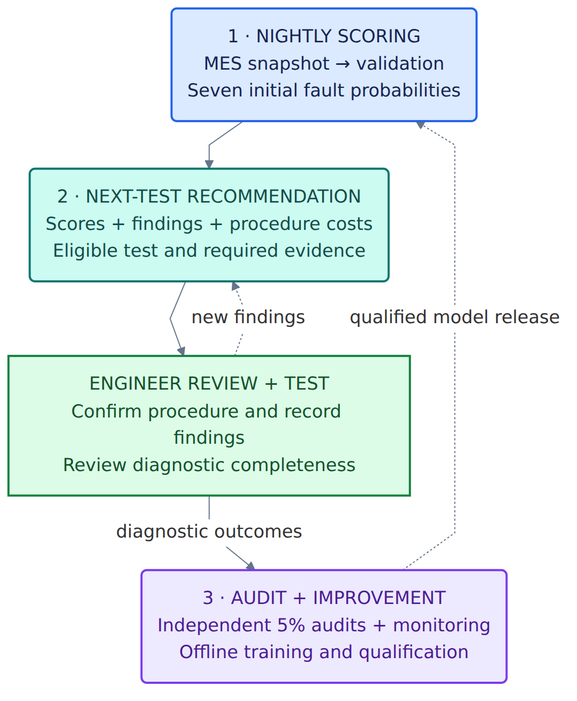

# Helion diagnostic test-selection presentation

**Audience:** apprentice team and mentors. **Team:** Group 8, member names to be supplied.  
**Format:** eight slides, 10 minutes, followed by individual viva questions. This Markdown outline includes speaker notes, not a generated slide deck.

**Evidence version:** This revision incorporates the executed offline research run `research_v2_concern_closure`. The [benchmark report](../../artifacts/helion_pipeline/research_v2_concern_closure/benchmark_report.md) and [executed pipeline walkthrough](../../artifacts/helion_pipeline/research_v2_concern_closure/pipeline_walkthrough.ipynb) supply the measured research results. The [design notebook](../design/P1_ml_systems_helion.ipynb) supplies the original rationale and proposed operating architecture. Separate those proposed capabilities from the implemented offline pipeline throughout the talk.

**Scope provenance:** The original [client brief](../brief/helion_semiconductor_client_brief.md) specifies one model and one next-test decision. This presentation focuses on that next-test decision and the diagnostic results of the offline benchmark. The [candidate rules](../design/mock_engineering_inspection_rules.md), version `MOCK-ENG-002`, and [synthetic operating assumptions](../../synthetic-data-assumptions/operation-assumptions/synthetic_operating_assumptions.md), version `SYN-OPS-001`, define the experiment. They do not supply the missing real SOP or operational evidence. Results below use synthetic data and assumed diagnostic performance. No production release or measured fab savings are established.

| Slide | Topic | Duration | Elapsed |
|---|---|---:|---:|
| 1 | Objective and decision ownership | 0:45 | 0:45 |
| 2 | Implemented pipeline and fair comparators | 1:00 | 1:45 |
| 3 | Evidence and operating assumptions | 1:15 | 3:00 |
| 4 | Fault-prediction findings | 1:30 | 4:30 |
| 5 | Diagnostic selection versus the baselines | 1:45 | 6:15 |
| 6 | Coexisting faults and diagnostic completeness | 1:15 | 7:30 |
| 7 | Proposed operation, monitoring and fallback | 1:30 | 9:00 |
| 8 | Interpretation and next experiments | 1:00 | 10:00 |

Timings total **600 seconds**, including pauses for calculations and architecture. Speaker notes guide rehearsal. Evidence references need not be spoken. Assign presenters, but everyone should be able to defend each decision. [Assessment format and seven dimensions](../brief/PRESENTATION_RUBRIC_APPRENTICE.md)

## Slide 1: Diagnostic test selection

**Time:** 0:00–0:45. **Key message:** Evaluate fault prediction and next-test selection against the business objective.

**On screen**

- Objective: lower investigation cost and turnaround under the same completeness requirements
- Does manufacturing context improve fault prediction?
- Do predictions improve the next-test choice beyond rules?
- Engineer selects the next diagnostic test and approves closure.

**Speaker notes**

Helion wants the on-duty engineer to choose the next diagnostic procedure while accounting for cost and useful completeness. Our research tests fault prediction and the next-test choices it supports. Better prediction alone need not change the work required. A real coexisting fault remains useful even when it adds work. The engineer retains procedure and closure authority. The headline finding is that the model predicts some synthetic faults usefully, but adds no demonstrated diagnostic value over the candidate rules in this experiment.

**Evidence:** Volume and objective: [brief](../brief/helion_semiconductor_client_brief.md). Proposed design: [notebook context](../design/P1_ml_systems_helion.ipynb#helion-context). **Rubric:** 1, framing and fit.

## Slide 2: Implemented pipeline and fair comparators

**Time:** 0:45–1:45. **Key message:** The same evidence and completeness rules govern every policy.

**On screen**

**Implemented offline:** validation, training, saved-model scoring, paired diagnostic replay and reporting.

| Comparator | Next-procedure choice |
|---|---|
| Candidate rules | Open concerns and co-fault safeguards in documented priority order |
| CT-first compatibility | Same priority under MOCK-ENG-002; retained as a regression comparator |
| Four heuristic arms | Same coverage/cost score with prevalence, inspection, full or manufacturing-only probabilities |

**Shared closure:** routine cases resolve opened concerns and failed acceptance branches; independent audits still require supported findings for all seven mechanisms. One conditional repeat is allowed after an inconclusive CT, acoustic or electrical attempt. Unfinished work remains pending.

**Speaker notes**

Acceptance has already rejected the stack. Diagnostic findings inform later process investigation without proving which machine caused a defect. We implemented six policies with the same costs, concern-opening rules, co-fault safeguards and report scope. The candidate rules and CT-first compatibility arm use the same v2 priority; heuristic arms may reorder eligible concern work. Findings change evidence and eligibility while initial probabilities remain fixed. A low probability never confirms absence. A gross-delamination CT negative cannot exclude all delamination, and IR provides localisation only. Open intact-sample obligations or contradictions block destructive SEM. These restrictions let us compare policies without rewarding omitted required work.

**Evidence:** [Implemented pipeline and six comparators](../../helion_pipeline/README.md), [benchmark §2](../../artifacts/helion_pipeline/research_v2_concern_closure/benchmark_report.md#2-do-predictions-improve-diagnostic-selection-beyond-rules), [candidate rules §§2–5](../design/mock_engineering_inspection_rules.md). **Rubric:** 1, baseline and task fit; 2, cost of incomplete diagnosis; 3, reproducible pipeline.

## Slide 3: Evidence and operating assumptions

**Time:** 1:45–3:00. **Key message:** Supplied synthetic labels and invented operating assumptions support a retrospective experiment.

**On screen**

| Verified in supplied files | Invented for the demonstration |
|---|---|
| 916 rejected stacks and seven synthetic fault labels | Procedure costs and report-outcome assumptions |
| 653 / 126 / 137 train/validation/test rejects | Mock inspection rules and closure standard |
| Test: six die-crack cases and two coexisting-fault cases | Test sensitivity/specificity and independent audit assignment |

**Assumed cost per attempt:** CT $120, acoustic $200, electrical isolation $600, IR $150, SEM $1,800.

- Some permitted acceptance readings directly encode synthetic fault information
- Still missing: real diagnostic histories, audit findings, qualified SOP and operating costs

**Speaker notes**

We retained the 653, 126 and 137 rejected-stack partitions with lot/time separation. All training targets come from supplied synthetic truth. Preprocessing fits training data only. IDs, later annotations, simulator internals and timing margin are excluded. Even so, permitted acceptance readings contain shortcuts: the detected-interconnect count equals the generated TSV-plus-microbump fault count. The manufacturing-only comparison exposes dependence on those inputs. Test data was already inspected, so findings are retrospective. Six crack cases and two coexisting cases limit conclusions. Dollar rates and report-error rates are assumptions. Costs charge technician and engineer labour, equipment occupancy and supplies. They represent consumed resources, not wholly avoidable cash. Forty cases received an independent synthetic audit assignment, fixed across policies. Real independent complete audits remain missing.

**Evidence:** [Benchmark evidence boundary](../../artifacts/helion_pipeline/research_v2_concern_closure/benchmark_report.md#evidence-and-design-boundary), [data validation](../../artifacts/helion_pipeline/research_v2_concern_closure/validation.json), [operating assumptions §§1–5](../../synthetic-data-assumptions/operation-assumptions/synthetic_operating_assumptions.md). **Rubric:** 3, data and leakage; 2, dollar-cost interpretation.

## Slide 4: Fault-prediction findings

**Time:** 3:00–4:30. **Key message:** Manufacturing context adds no demonstrated predictive benefit over inspection/acceptance alone.

**On screen**

**Retrospective test cohort: 137 rejected stacks.** Seven independent binary logistic heads produce fault probabilities that need not sum to one.

| Input comparison | Macro average precision ↑ | Mean binary log loss ↓ |
|---|---:|---:|
| Constant training prevalence | 0.145 | 0.402 |
| Inspection/acceptance | **0.504** | **0.231** |
| Full allowed context | 0.497 | 0.251 |
| Manufacturing/package only | 0.189 | 0.408 |

**0.497 is macro average precision:** a ranking summary averaged equally across seven faults. It does **not** mean 49.7% of diagnoses are correct.

**Full-model weak points:** die crack AP 0.102, delamination 0.232, underfill void 0.281. Synthetic shortcuts limit real-world interpretation.

**Speaker notes**

We fitted regularised logistic regression with training-only imputation, missingness indicators, scaling and categorical encoding. All learned alternatives used the same training-lot folds and three-value regularisation search. A single saved artifact retains the research alternatives. Each has seven binary heads, so faults may coexist. Average precision summarises precision and recall across ranking thresholds. Macro averaging gives every mechanism equal weight. It differs from precision at a selected threshold and from diagnosis accuracy. Both acceptance-based variants exceed the 0.145 prevalence reference, but full context does not improve the point estimates. The paired 95% interval for full-minus-inspection macro AP spans −0.058 to +0.047, so the small AP difference is uncertain. Full-model Brier score is 0.081 versus inspection's 0.077, with lower preferred. Calibration was assessed without fitting an extra calibrator. Strong electrical prediction and weak rare-fault prediction should not disappear inside one average.

**Visual option:** [Prediction comparison](../../artifacts/helion_pipeline/research_v2_concern_closure/figures/prediction_comparison.png). Use the table or chart on screen, without duplicating both.

**Evidence:** [Predictive metrics, test rows](../../artifacts/helion_pipeline/research_v2_concern_closure/predictive_metrics.csv), [paired uncertainty](../../artifacts/helion_pipeline/research_v2_concern_closure/predictive_paired_comparisons.csv), [calibration figure](../../artifacts/helion_pipeline/research_v2_concern_closure/figures/calibration.png), [training record](../../artifacts/helion_pipeline/research_v2_concern_closure/training.json). **Rubric:** 1, target and fit; 2, metric meaning; 6, model limitations.

## Slide 5: Diagnostic selection versus the baselines

**Time:** 4:30–6:15. **Key message:** The model adds no demonstrated diagnostic benefit over the candidate rules under these assumptions.

**On screen**

**Base test replay: 137 cases × 100 paired report replications per policy.**

| Policy | Mean resource dollars consumed/case | Evidence complete | Correctly complete against truth |
|---|---:|---:|---:|
| Candidate rules | $1,169.26 | 86.6% | 82.3% |
| CT-first compatibility | $1,169.26 | 86.6% | 82.3% |
| Full-model heuristic | $1,170.92 | 86.6% | 82.3% |

- Candidate rules and CT-first compatibility are identical under MOCK-ENG-002
- Full versus candidate rules: **+$1.66/case**, 95% lot-bootstrap interval **[+$0.51, +$2.98]**
- Full-model ordering changes about **5.9%** of test sequences and lowers missed faults by roughly **0.002/case**, without a material completion change
- Full model still has **$60.44/case** of known pending procedures on average
- Every case counts, including unfinished investigations. These are simulated resource costs, not demonstrated fab savings.

**Speaker notes**

Policies received the same potential reports for each sample, procedure and attempt, with shared audit assignments. A hundred replications vary assumed report outcomes on the same cases; they do not create new independent samples. Candidate rules and CT-first are identical under the v2 concern-priority implementation. The full model changes about 5.9% of sequences, costs $1.66 more per case and slightly lowers missed faults, while rounded completion and correctly-complete rates remain unchanged. That is not demonstrated operational value. Pending dollars cover known unattempted procedures only. Manual review and future resolution remain unpriced. Conditional nondestructive repeats and blocked destructive work keep inconclusive cases visible. The 1,000 paired lot-cluster bootstrap resamples quantify case uncertainty separately from Monte Carlo variation. Cost and report-error stresses test assumptions without establishing real-world benefit.

**Visual option:** [Diagnostic cost and quality trade-offs](../../artifacts/helion_pipeline/research_v2_concern_closure/figures/diagnostic_tradeoffs.png). Overlapping points reflect identical results, not missing policies.

**Evidence:** [Decision metrics, base/test rows](../../artifacts/helion_pipeline/research_v2_concern_closure/decision_metrics.csv), [paired uncertainty, full/cost row](../../artifacts/helion_pipeline/research_v2_concern_closure/decision_uncertainty.csv), [post-run verification](../../artifacts/helion_pipeline/research_v2_concern_closure/verification.json), [benchmark interpretation and stresses](../../artifacts/helion_pipeline/research_v2_concern_closure/benchmark_report.md). **Rubric:** 2, costs and diagnostic quality; 3, paired evaluation; 6, attribution and uncertainty.

## Slide 6: Dispatch changes which milestone is met

**Time:** 6:15–7:30. **Key message:** Scheduling can change deadline feasibility without changing procedure cost.

**On screen**

**Case D:** resources are unavailable before 09:00. B's warpage milestone is 10:00; A's underfill milestone is 11:00.

- A-first makes B late; B-first meets both scoped milestones if reports are conclusive
- Both orders cost $240 and finish at 10:30
- Staff phases, equipment and specimen exclusivity remain feasible
- Inconclusive findings remain unresolved; the supplied calendar supports only the existing 24-hour fixtures

**Speaker notes**

The scheduler uses the existing one-day snapshot, preserving commitments before 09:00. TECH-01 prepares each stack for 15 minutes and QE-01 interprets the final 15 minutes; those phases and equipment reservations do not conflict. A-first misses B's milestone even though both orders consume the same resources. This demonstrates dispatch feasibility for the documented cases, not a quarterly turnaround gain. An inconclusive B remains unresolved and does not cancel A's accepted booking. Case B has $920 spent with SEM pending; Case C's $2,720 conclusive path remains a conditional cost trace because the supplied calendar cannot support a future SEM appointment.

**Evidence:** [Scheduling results](../../artifacts/helion_pipeline/research_v2_concern_closure/scheduling.json), [deterministic walkthroughs](../../artifacts/helion_pipeline/research_v2_concern_closure/walkthroughs.json), [Case D assumptions](../../synthetic-data-assumptions/operation-assumptions/synthetic_operating_assumptions.md). **Rubric:** 2, time/cost consequences; 7, defence through a worked case.

## Slide 7: Proposed operation, monitoring and fallback

**Time:** 7:30–9:00. **Key message:** The offline package tests the design. Fab integration and qualification remain proposed.

**On screen**

**Implemented:** reproducible offline CLI, saved preprocessing/models, simulated evidence and reports.

**Proposed architecture below:** nightly MES ingestion, local engineer interface, current diagnostic findings, monitoring and qualified release.

[Three separate detail views](../design/architecture.md) · [Editable Mermaid](../design/images/helion-architecture.mmd) · [Vector SVG](../design/images/helion-architecture.svg)

**Update the next-test recommendation:** new findings change mechanism states and procedure eligibility. Preserve prior evidence; initial model probabilities remain fixed.

**Fallback:** the engineer follows the existing SOP when required inputs or qualification checks fail.

**Speaker notes**

The diagram remains the proposed fab architecture. Our implementation is an offline CLI with saved preprocessing, recorded seeds, dependencies and checksums. It installs no nightly job, interface or production service. Proposed nightly scoring fits the local environment, while new diagnostic findings would update eligibility between imports. Failed imports produce no fresh scores. Missing required records or unknown tool/supplier conditions route to rules or manual review. Monitoring would separate input drift from audited outcome deterioration. Unresolved investigations, inconclusive frequency and engineer overrides are early proxies while labels arrive. Yield Engineering would review model outcomes and IT would investigate ingestion failures. New tools or suppliers trigger qualification review. Independent audit selection remains separate from model recommendations. Only qualified, complete audit findings enter the reference-label cohort. Inconclusive or contradictory audits remain incomplete. Only reviewed candidates could replace a qualified model. These operational controls still require real records and prospective testing.

**Evidence:** [Implemented boundaries and fallback](../../helion_pipeline/README.md), [run manifest](../../artifacts/helion_pipeline/research_v2_concern_closure/run_manifest.json), [brief constraints](../brief/helion_semiconductor_client_brief.md), [proposed notebook operations](../design/P1_ml_systems_helion.ipynb#helion-operations). **Rubric:** 4, serving fit and reproducibility; 5, monitoring and feedback.

## Slide 8: Interpretation and next experiments

**Time:** 9:00–10:00. **Key message:** Model improvements must earn value beyond rules under a qualified diagnostic standard.

**On screen**

- Finding: full context adds no demonstrated benefit over inspection prediction or CT-first diagnostic selection
- Prediction work: inspect weak-fault errors, feature availability and regularisation using training-lot validation
- Decision work: qualify the real SOP, valid alternative paths, report scope and continuation costs
- Collect representative complete audits and fresh prospective evidence before a shadow study or controlled pilot
- Retaining rules remains a valid outcome. No policy is selected for operational release.

**Speaker notes**

Improving the 0.497 macro AP alone would not establish business benefit. Investigate errors for cracks, voids and delamination, then test limited feature or regularisation changes using training-lot validation. Avoid repeated optimisation against this already-inspected test cohort. In parallel, engineers must identify where qualified alternative procedures could change completion cost. Lab operations and finance should validate the assumed procedure costs. Quality must confirm report scope, repeat rules and closure. Roughly forty-five stacks per quarter would be selected for full-battery audits, with fewer potentially yielding complete supported labels. Rare-fault evidence will be limited, so pool history carefully and retain a fresh prospective evaluation. Any subsequent shadow study and pilot need qualification first. The experiment supports honest uncertainty and a continued rules-based option, rather than an automatic model release.

**Evidence:** [Benchmark limitations and next evidence](../../artifacts/helion_pipeline/research_v2_concern_closure/benchmark_report.md#operational-boundary-and-next-evidence), [operating assumptions §6](../../synthetic-data-assumptions/operation-assumptions/synthetic_operating_assumptions.md#6-how-to-use-and-challenge-the-assumptions), [brief audit requirement](../brief/helion_semiconductor_client_brief.md), [rubric](../brief/PRESENTATION_RUBRIC_APPRENTICE.md). Further improvement experiments have not been run beyond `research_v2_concern_closure`. **Rubric:** 6, prioritisation; 7, honest defence.

## Rehearsal and viva handoff

Use the [viva preparation](viva_preparation.md) for design questions and the [executed pipeline walkthrough](../../artifacts/helion_pipeline/research_v2_concern_closure/pipeline_walkthrough.ipynb) and [benchmark report](../../artifacts/helion_pipeline/research_v2_concern_closure/benchmark_report.md) for current findings. Earlier design documents and archived v1 artifacts contain superseded assumptions that must not be presented as current measured results. The questions below are rehearsal prompts, not the mentors' question bank.

- **Why is 0.497 not “half the diagnoses correct”?** Explain macro average precision, the prevalence reference and per-fault support. Distinguish this from the separate 48.42% correctly-complete simulated investigation rate.
- **Why can good prediction add little selection value?** Explain how concern-opening rules and co-fault safeguards can preserve most of the procedure set despite changed order.
- **Is +$1.66/case evidence against ML in every setting?** No. It is a paired synthetic result under candidate rules and assumed report behavior; it shows no incremental value here, not a universal conclusion.
- **Why is a second true fault useful?** It supplies additional evidence for process investigation. Comparing policies requires the same completeness standard, so omitting it is not a fair saving.
- **What do 100 replications establish?** Variation under assumed report outcomes for the same cases. Lot-bootstrap uncertainty, Monte Carlo variation and assumption stresses answer different questions.
- **What would change the recommendation?** Qualified alternative diagnostic paths, representative audit outcomes and fresh evidence of incremental cost/quality value beyond the rules.

Retain the [workflow walkthrough](../design/workflow_walkthrough.md) for inconclusive, contradictory, coexisting-fault and missing-data branches. Practise failed imports, incomplete audits and new tool/supplier conditions. Recalculate the $200 acoustic cost, $920 spent before pending SEM, and the $2,720 conclusive path using the [operating assumptions](../../synthetic-data-assumptions/operation-assumptions/synthetic_operating_assumptions.md). These rehearsal notes are outside the eight-slide timing. Member names, personal reflections and actual experiences must come from the team.
